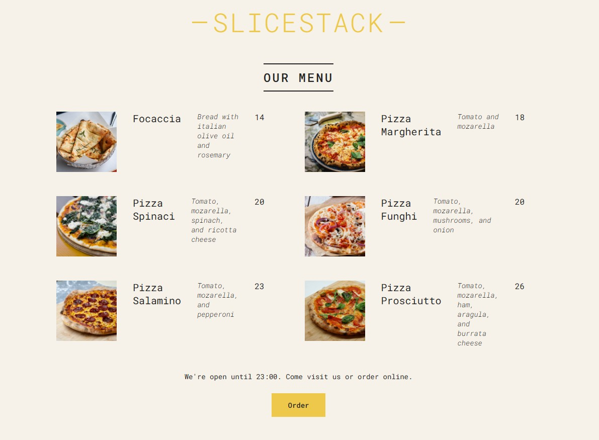

<div align="center">
  <h1>🍕 SliceStack – React Pizza Menu</h1>



  <p>
    <strong>A clean, modern, and beginner-friendly React pizza menu project</strong><br>
    Perfect for learning components, props, lists, conditional rendering and basic styling.
  </p>

  <p>
    <a href="https://react.dev">
      
    </a>
    <a href="https://github.com/facebook/create-react-app">
      
    </a>
    
  </p>

</div>

## ✨ Features

- 🍕 Dynamic menu built from an array of pizza objects
- 📋 Shows name, ingredients, price and photo for each pizza
- 🚫 Clear “Sold Out” state with conditional rendering
- 🎨 Modern, clean and responsive design (pure CSS or your styling choice)
- ⚛️ Uses only **functional components** + modern React practices
- Ideal mini-project to master:
  - Component structure
  - Props drilling
  - `.map()` for rendering lists
  - Conditional rendering (ternary / &&)
  - Basic responsive layout

## 🚀 Quick Start

```bash
# 1. Clone this repository
git clone https://github.com/ranjan-uprety/slice-stack.git
cd slice-stack

# 2. Install dependencies
npm install

# 3. Start the development server
npm start
```
